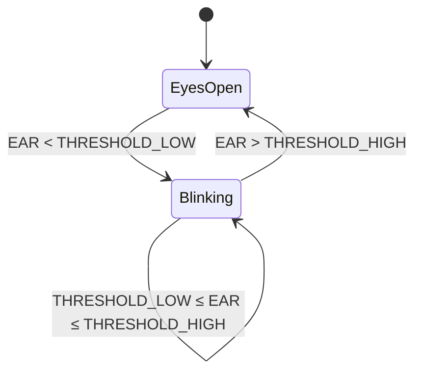
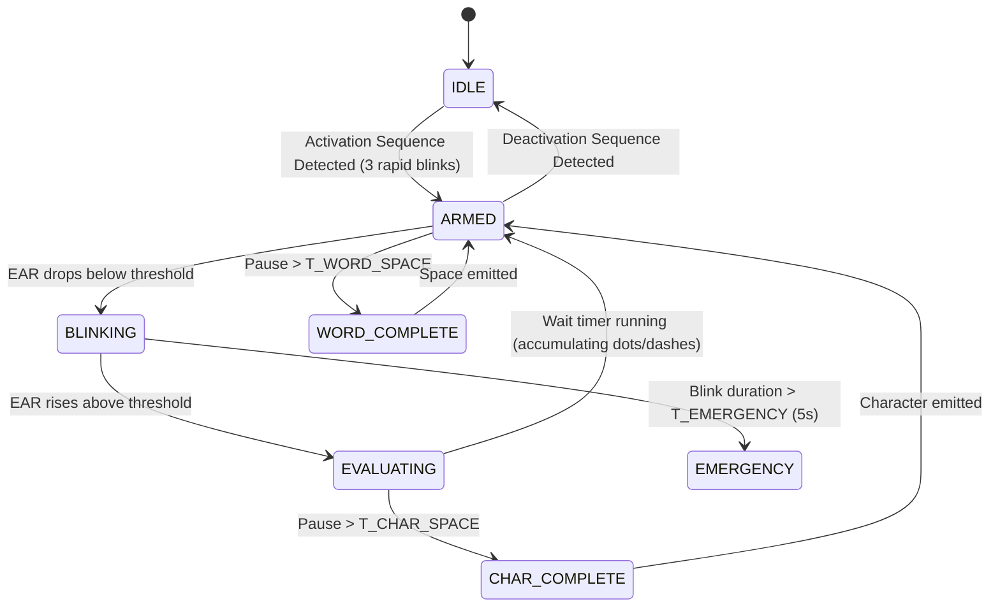

# Algorithm Design: Blink Detection, Signal Processing & Morse Code

> This document provides the complete mathematical and algorithmic foundation for Auralis. Every formula, constant, and state transition is documented here for reproducibility and clinical review.

---

## 1. Eye Aspect Ratio (EAR) — Primary Blink Signal

### 1.1 Landmark Selection (MediaPipe Face Mesh Indices)

MediaPipe provides 468 3D facial landmarks. For blink detection, we use 6 landmarks per eye:

| Point | Left Eye Index | Right Eye Index | Position |
|-------|---------------|-----------------|----------|
| p1 | 362 | 33 | Lateral (outer) corner |
| p2 | 385 | 160 | Superior (upper) eyelid, medial |
| p3 | 387 | 158 | Superior (upper) eyelid, lateral |
| p4 | 263 | 133 | Medial (inner) corner |
| p5 | 373 | 153 | Inferior (lower) eyelid, lateral |
| p6 | 380 | 144 | Inferior (lower) eyelid, medial |

### 1.2 The EAR Formula

```
        ||p2 - p6|| + ||p3 - p5||
EAR = ─────────────────────────────
            2.0 × ||p1 - p4||
```

Where `||a - b||` is the **3D Euclidean distance**:

```javascript
function euclidean3D(a, b) {
  return Math.sqrt(
    (a.x - b.x) ** 2 + 
    (a.y - b.y) ** 2 + 
    (a.z - b.z) ** 2
  );
}
```

### 1.3 EAR Behavior
| State | Typical EAR Range | Notes |
|-------|-------------------|-------|
| Eyes fully open | 0.25 – 0.40 | Varies per individual |
| Partial blink | 0.15 – 0.25 | Should NOT trigger detection |
| Full intentional blink | 0.00 – 0.10 | Target detection zone |
| Eyes closed (sustained) | 0.00 – 0.05 | Triggers dash or emergency |

### 1.4 Bilateral EAR
We compute EAR for **both eyes** and average them:
```
EAR_final = (EAR_left + EAR_right) / 2.0
```
This compensates for users who may have asymmetric facial features, partial paralysis on one side, or a lazy eye.

---

## 2. Signal Processing Pipeline

Raw EAR values are noisy due to camera jitter, lighting fluctuations, and natural micro-tremors. We apply a **three-stage signal processing pipeline** before threshold detection.

### 2.1 Stage 1: Kalman Filter
A 1D Kalman filter smooths high-frequency noise from the EAR signal.

```javascript
import KalmanFilter from 'kalmanjs';

const kalman = new KalmanFilter({ R: 0.01, Q: 3 });
// R = measurement noise (low = trust the measurement)
// Q = process noise (high = allow fast changes, like blinks)

const smoothedEAR = kalman.filter(rawEAR);
```

**Why Kalman over a simple moving average?** A moving average introduces lag proportional to the window size, which delays blink detection. A Kalman filter provides smoothing with near-zero lag, critical for real-time response.

### 2.2 Stage 2: Adaptive Baseline (Exponential Moving Average)
The "eyes open" baseline EAR changes over time (fatigue causes droopy eyelids, lighting shifts). We track this using an EMA:

```javascript
// α = smoothing factor (0.01 = slow adaptation, very stable)
const ALPHA = 0.01;

if (currentEAR > blinkThreshold) {
  baseline = ALPHA * currentEAR + (1 - ALPHA) * baseline;
}
```

The blink threshold is then computed **relative to the baseline**, not as a fixed value:

```
dynamicThreshold = baseline × 0.65
```

This means the system automatically recalibrates as the user's eye openness changes.

### 2.3 Stage 3: Hysteresis (Schmitt Trigger)
To prevent rapid toggling at the threshold boundary (the "flickering" problem), we use hysteresis with two thresholds:

```
THRESHOLD_LOW  = baseline × 0.55   (must cross this to ENTER blink state)
THRESHOLD_HIGH = baseline × 0.75   (must cross this to EXIT blink state)
```



---

## 3. Head Aspect Ratio (HAR) — Secondary Input Channel

Using the nose tip (landmark 1), chin (landmark 152), and ear landmarks (landmarks 234, 454), we calculate head tilt:

```javascript
function calculateHeadTilt(landmarks) {
  const noseTip = landmarks[1];
  const chin = landmarks[152];
  const leftEar = landmarks[234];
  const rightEar = landmarks[454];
  
  // Roll angle (head tilt left/right)
  const deltaY = rightEar.y - leftEar.y;
  const deltaX = rightEar.x - leftEar.x;
  const rollAngle = Math.atan2(deltaY, deltaX) * (180 / Math.PI);
  
  return rollAngle; // Negative = tilt left, Positive = tilt right
}
```

| Gesture | Roll Angle | Action |
|---------|-----------|--------|
| Neutral | -5° to +5° | No action |
| Tilt Left | < -15° | Select prediction #1 |
| Tilt Right | > +15° | Select prediction #2 |

---

## 4. Mouth Aspect Ratio (MAR) — Tertiary Input Channel

Similar to EAR but for the mouth:

```
        ||upper_lip - lower_lip||
MAR = ──────────────────────────────
        ||left_corner - right_corner||
```

| Landmark | Index | Position |
|----------|-------|----------|
| Upper lip | 13 | Top center of upper lip |
| Lower lip | 14 | Bottom center of lower lip |
| Left corner | 61 | Left mouth corner |
| Right corner | 291 | Right mouth corner |

| State | MAR | Action |
|-------|-----|--------|
| Closed | < 0.3 | No action |
| Open (sustained > 1s) | > 0.6 | Trigger "Speak" command |

---

## 5. Morse Code Finite State Machine

### 5.1 States



### 5.2 Timing Constants (User-Calibrated Defaults)
| Constant | Default Value | Description | Adjustable? |
|----------|--------------|-------------|-------------|
| `T_DOT_MAX` | 300ms | Maximum blink duration to classify as DOT | Yes (calibration) |
| `T_DASH_MIN` | 400ms | Minimum blink duration to classify as DASH | Yes (calibration) |
| `T_DASH_MAX` | 1500ms | Maximum blink duration for DASH (beyond = discard/command) | Yes |
| `T_CHAR_SPACE` | 800ms | Eyes-open pause to finalize current letter | Yes |
| `T_WORD_SPACE` | 2000ms | Eyes-open pause to insert a space | Yes |
| `T_EMERGENCY` | 5000ms | Sustained eye closure to trigger emergency | Fixed |
| `T_DEBOUNCE` | 50ms | Minimum time between blink state changes | Fixed |

### 5.3 Involuntary Blink Rejection
Normal involuntary blinks have specific characteristics:
- Duration: 100–150ms (very short)
- Both eyes close simultaneously and symmetrically
- Frequency: 15–20 per minute

**Rejection strategies:**
1. **Duration filter:** Blinks < 80ms are discarded (too fast to be intentional).
2. **System armed state:** Blinks are only interpreted as Morse code when the system is ARMED (after the activation sequence).
3. **Cooldown window:** After processing a blink, ignore the next 50ms of EAR data.

---

## 6. Fatigue Detection Algorithm

### 6.1 Metrics Tracked (Sliding 5-Minute Window)
| Metric | Calculation | Fatigue Indicator |
|--------|-------------|-------------------|
| Baseline EAR drift | `current_baseline - session_start_baseline` | Decreasing = eyes drooping = fatigue |
| Blink rate | Blinks per minute | Increasing above normal (>25/min) |
| Blink duration trend | Average blink duration over window | Increasing = slower responses |
| Response time | Time from system prompt to user response | Increasing = cognitive fatigue |

### 6.2 Fatigue Score Calculation
```javascript
function calculateFatigueScore(metrics) {
  const earDrift = Math.max(0, (metrics.startBaseline - metrics.currentBaseline) / metrics.startBaseline);
  const blinkRateScore = Math.max(0, (metrics.currentBlinkRate - 20) / 20);
  const durationScore = Math.max(0, (metrics.avgBlinkDuration - 200) / 300);
  
  // Weighted combination (EAR drift is most reliable)
  return (earDrift * 0.5) + (blinkRateScore * 0.3) + (durationScore * 0.2);
}

// Score interpretation:
// 0.0 - 0.3 = Normal
// 0.3 - 0.6 = Mild fatigue (show subtle indicator)
// 0.6 - 0.8 = Moderate fatigue (suggest break)
// 0.8 - 1.0 = Severe fatigue (strongly recommend stopping)
```

---

## 7. Predictive Text Algorithm

### 7.1 Trie-Based Dictionary
We use a **Trie (prefix tree)** for O(m) prefix lookups where m = length of current input:

```
Root
├── H
│   ├── E
│   │   ├── L
│   │   │   ├── L
│   │   │   │   └── O (freq: 847)
│   │   │   └── P (freq: 1203)
│   │   └── A
│   │       ├── D (freq: 342)
│   │       └── R (freq: 156)
│   └── U
│       ├── R
│       │   └── T (freq: 589)
│       └── N
│           ├── G
│           │   ├── R
│           │   │   └── Y (freq: 213)
│           │   └── ER (freq: 0 — medical term, lower base freq but boosted by context)
```

### 7.2 Scoring Formula
```
score(word) = base_frequency × recency_boost × medical_context_boost
```

- **base_frequency:** How common the word is in English (pre-computed from word frequency lists)
- **recency_boost:** Words used recently by this user get a 2x–5x multiplier
- **medical_context_boost:** If the user has typed "I feel" → boost pain/symptom words ("hurt", "dizzy", "nauseous")

### 7.3 Medical Vocabulary Extensions
The dictionary includes specialized medical terms that standard predictive keyboards lack:
- Pain scale words: "throbbing", "sharp", "dull", "aching", "burning"
- Body parts: "abdomen", "lumbar", "cervical", "thoracic"
- Common patient needs: "suction", "reposition", "medication", "bathroom"
- Emotional states: "anxious", "frustrated", "comfortable", "scared"
