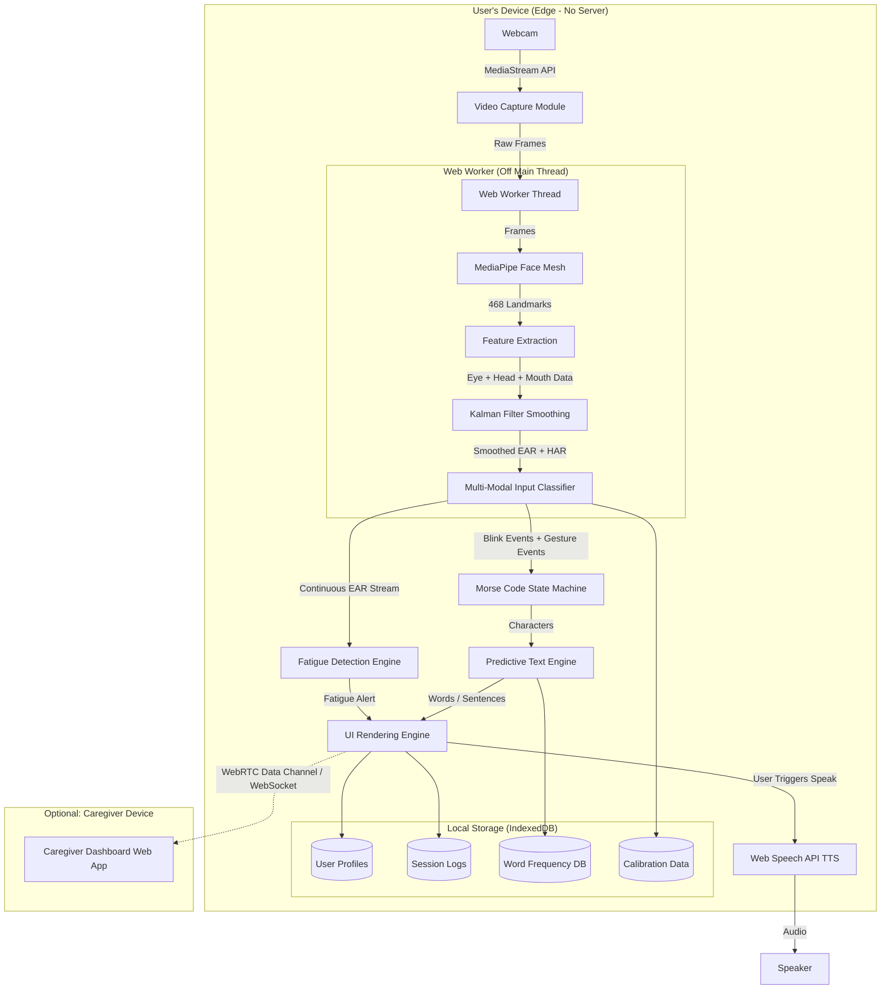
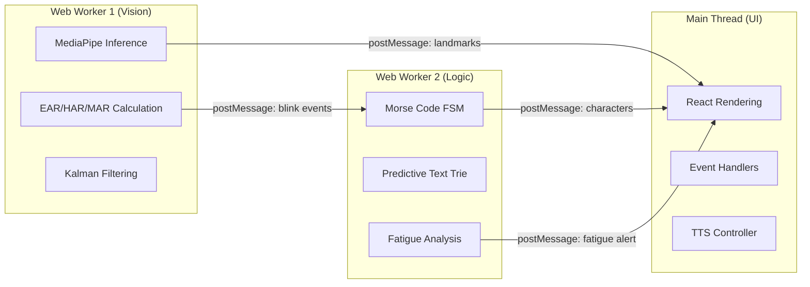

# System Architecture

> This document defines the complete system architecture for Auralis, designed as a production-grade, medical-ready AAC application.

---

## 1. Architectural Pattern: Client-Side Edge AI with Optional Caregiver Bridge

Auralis uses a **hybrid architecture**: the core AAC engine runs 100% on the client (Edge AI), while an optional caregiver dashboard uses lightweight WebSocket/WebRTC for real-time monitoring.

---

## 2. Module Breakdown

### 2.1 Video Capture Module
| Property | Detail |
|----------|--------|
| **API** | `navigator.mediaDevices.getUserMedia({ video: { facingMode: 'user', width: { ideal: 640 }, height: { ideal: 480 } } })` |
| **Frame Rate** | Capped at 30fps to balance accuracy vs. CPU usage |
| **Responsibility** | Manages camera lifecycle (permissions, stream start/stop, error handling), delivers frames to the inference pipeline |
| **Fallback** | If camera is denied, shows clear instructions with platform-specific screenshots |

### 2.2 Inference Engine (MediaPipe Face Mesh)
| Property | Detail |
|----------|--------|
| **Library** | `@mediapipe/tasks-vision` (latest MediaPipe Vision Tasks API) |
| **Model** | Face Landmarker with 468 landmarks, refined iris tracking |
| **Execution** | Runs inside a **Web Worker** to avoid blocking the UI thread |
| **Output** | Array of 468 normalized 3D coordinates per detected face |
| **Key Innovation** | We extract not just eye landmarks but also: head pose (pitch/yaw/roll), mouth landmarks (for future mouth-gesture input), and iris position (for gaze direction) |

### 2.3 Feature Extraction & Signal Processing
| Property | Detail |
|----------|--------|
| **EAR (Eye Aspect Ratio)** | Primary blink detection signal |
| **HAR (Head Aspect Ratio)** | Head tilt detection for secondary input channel |
| **MAR (Mouth Aspect Ratio)** | Mouth opening for tertiary input (e.g., "speak now" command) |
| **Kalman Filter** | Applied to EAR to smooth out noise from lighting changes, micro-tremors, and camera jitter. Uses `kalmanjs` library. |
| **Rolling Baseline** | Continuously updates the "eyes open" baseline EAR using an exponential moving average (EMA) to adapt to gradual lighting changes |

### 2.4 Multi-Modal Input Classifier
This is what makes Auralis **unique**. Instead of relying solely on blinks:
- **Blink** → Primary Morse code input (dot/dash)
- **Head tilt left** → Select predictive text suggestion #1
- **Head tilt right** → Select predictive text suggestion #2
- **Sustained mouth open** → Trigger "Speak" command
- **Triple rapid blink** → Activate / Deactivate the system (toggle sleep mode)
- **5-second eye close** → Emergency SOS mode

### 2.5 Morse Code State Machine
| Property | Detail |
|----------|--------|
| **Pattern** | Finite State Machine (FSM) with states: `IDLE`, `BLINKING`, `WAITING`, `COOLDOWN` |
| **Timing** | All timing constants are derived from the user's calibration profile, not hardcoded |
| **Debounce** | 50ms debounce window to prevent double-detection of a single blink |
| **Output** | Emits events: `onDot`, `onDash`, `onCharacterComplete`, `onWordComplete`, `onCommandDetected` |

### 2.6 Predictive Text Engine
| Property | Detail |
|----------|--------|
| **Algorithm** | Trie-based dictionary lookup + frequency-weighted scoring |
| **Dictionary** | Pre-loaded English dictionary (~10,000 most common words) + medical vocabulary (pain scales, body parts, medication names) |
| **Learning** | Tracks user word frequency in IndexedDB, personalizing predictions over time |
| **Display** | Shows top 3 suggestions; selectable via head tilt or specific blink pattern |

### 2.7 Fatigue Detection Engine
| Property | Detail |
|----------|--------|
| **Signals** | Decreasing EAR baseline over time, increasing blink frequency, slower blink response times |
| **Algorithm** | Sliding window analysis (last 5 minutes) comparing current metrics to session-start baseline |
| **Response** | Warns the user with a gentle visual + audio cue. If fatigue worsens, suggests a rest break. Does NOT forcibly stop the user — autonomy is paramount. |

### 2.8 Emergency System
| Property | Detail |
|----------|--------|
| **Activation** | 5-second sustained eye closure OR a pre-configured rapid blink sequence |
| **Action** | Immediately speaks a pre-configured emergency phrase (e.g., "I need help" / "Call a nurse" / "I am in pain") |
| **Priority** | Bypasses the Morse code engine entirely — zero delay |
| **Customization** | Caregiver can pre-configure the emergency phrases during setup |

### 2.9 Local Data Layer (IndexedDB via Dexie.js)
| Store | Contents |
|-------|----------|
| `profiles` | User calibration data, EAR baselines, timing preferences |
| `sessions` | Timestamped logs of every session (characters typed, fatigue events, errors) |
| `dictionary` | Custom words added by the user, frequency counters |
| `settings` | TTS voice, volume, UI theme, emergency phrases |

### 2.10 Caregiver Dashboard (Optional Module)
| Property | Detail |
|----------|--------|
| **Connection** | Peer-to-peer via WebRTC Data Channel (no server required) or local WebSocket on same network |
| **Features** | View typed text in real-time, see fatigue alerts, adjust settings remotely, review session history |
| **Privacy** | Caregiver sees TEXT only — never the video feed |

---

## 3. Performance Architecture

### Threading Model

### Performance Targets
| Metric | Target | Measurement |
|--------|--------|-------------|
| Frame processing latency | < 16ms (60fps capable) | `performance.now()` around inference call |
| Blink-to-character latency | < 200ms | Timestamp delta from EAR drop to character render |
| Memory usage | < 150MB | Chrome DevTools Performance Monitor |
| CPU usage (sustained) | < 40% on mid-range laptop | Chrome Task Manager |
| First paint to interactive | < 3 seconds | Lighthouse |
| PWA install size | < 25MB | Service Worker cache audit |

---

## 4. Offline-First & PWA Strategy

Auralis must work **completely offline** after the first load. This is critical because many users are in hospital rooms, rural areas, or settings without reliable internet.

1. **Service Worker (Workbox):** Caches all static assets, MediaPipe WASM binaries, and model files on first load.
2. **IndexedDB:** All user data persists locally.
3. **PWA Manifest:** Enables "Add to Home Screen" on mobile and desktop, making Auralis behave like a native app.
4. **Update Strategy:** When internet is available, check for updates silently and prompt the user (via a non-intrusive banner) to refresh.
