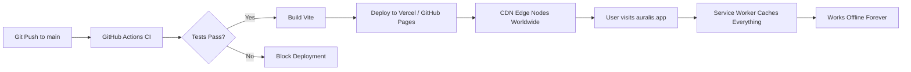

# Deployment Guide — Auralis AAC

> Auralis is designed to be deployable with zero cost and zero backend infrastructure.

---

## 1. Deployment Architecture

Auralis is a **static Progressive Web App (PWA)**. It requires no server, no database, and no API keys. Deployment is as simple as uploading static files to any hosting platform.



---

## 2. Hosting Options (All Free Tier)

| Platform | Pros | Cons | Setup |
|----------|------|------|-------|
| **Vercel** (Recommended) | Auto-deploy on push, global CDN, free SSL, preview URLs for PRs | 100GB bandwidth/month (more than enough) | Connect GitHub repo → auto-detected as Vite |
| **GitHub Pages** | Native GitHub integration, zero config | No server-side redirects (but we don't need them) | Set build output to `dist/`, enable in repo settings |
| **Netlify** | Similar to Vercel, built-in form handling | 100GB bandwidth/month | Connect GitHub repo |
| **Cloudflare Pages** | Unlimited bandwidth, global CDN | Slightly more complex setup | Connect GitHub repo |

---

## 3. Build Process

### 3.1 Production Build
```bash
# Install dependencies
npm ci

# Run all tests
npm run test

# Build for production
npm run build

# Preview production build locally
npm run preview
```

### 3.2 Vite Configuration for Production
```javascript
// vite.config.ts
export default defineConfig({
  build: {
    target: 'es2020',
    outDir: 'dist',
    sourcemap: false,
    rollupOptions: {
      output: {
        manualChunks: {
          'mediapipe': ['@mediapipe/tasks-vision'],
          'vendor': ['react', 'react-dom'],
        }
      }
    }
  },
  // PWA plugin configuration
  plugins: [
    react(),
    VitePWA({
      registerType: 'autoUpdate',
      workbox: {
        globPatterns: ['**/*.{js,css,html,wasm,tflite}'],
        maximumFileSizeToCacheInBytes: 10 * 1024 * 1024, // 10MB for model files
      },
      manifest: {
        name: 'Auralis AAC',
        short_name: 'Auralis',
        description: 'AI-Powered Blink-to-Speech Communication',
        theme_color: '#0A0A0F',
        background_color: '#0A0A0F',
        display: 'standalone',
        orientation: 'any',
        icons: [
          { src: '/icon-192.png', sizes: '192x192', type: 'image/png' },
          { src: '/icon-512.png', sizes: '512x512', type: 'image/png' },
          { src: '/icon-maskable.png', sizes: '512x512', type: 'image/png', purpose: 'maskable' }
        ]
      }
    })
  ]
});
```

---

## 4. CI/CD Pipeline (GitHub Actions)

```yaml
# .github/workflows/deploy.yml
name: Test, Build & Deploy

on:
  push:
    branches: [main]
  pull_request:
    branches: [main]

jobs:
  test:
    runs-on: ubuntu-latest
    steps:
      - uses: actions/checkout@v4
      - uses: actions/setup-node@v4
        with:
          node-version: '20'
          cache: 'npm'
      - run: npm ci
      - run: npm run lint
      - run: npm run test -- --coverage
      - run: npm run build

  deploy:
    needs: test
    if: github.ref == 'refs/heads/main'
    runs-on: ubuntu-latest
    steps:
      - uses: actions/checkout@v4
      - uses: actions/setup-node@v4
        with:
          node-version: '20'
          cache: 'npm'
      - run: npm ci
      - run: npm run build
      - uses: amondnet/vercel-action@v25
        with:
          vercel-token: ${{ secrets.VERCEL_TOKEN }}
          vercel-org-id: ${{ secrets.VERCEL_ORG_ID }}
          vercel-project-id: ${{ secrets.VERCEL_PROJECT_ID }}
          vercel-args: '--prod'
```

---

## 5. PWA Installation

### Desktop (Chrome / Edge)
1. Visit the Auralis URL.
2. Click the "Install" icon in the address bar.
3. Auralis opens as a standalone app — no browser chrome.

### Mobile (Android)
1. Visit the Auralis URL in Chrome.
2. Tap "Add to Home Screen" banner (or menu → Install).
3. Auralis appears as an app icon on the home screen.

### Mobile (iOS / iPadOS)
1. Visit the Auralis URL in Safari.
2. Tap Share → "Add to Home Screen".
3. Auralis appears as an app icon.

---

## 6. Offline Capability Verification

After deployment, verify offline functionality:

1. Load the app once with internet.
2. Open Chrome DevTools → Application → Service Workers → verify registered.
3. Enable Airplane Mode.
4. Reload the page — it should load fully from cache.
5. Test camera access (still works offline — camera is a local device).
6. Test TTS (still works offline — Web Speech API uses on-device voices).
7. Test all core features: calibration, blink detection, Morse code, text output, speech.

---

## 7. Domain & SSL

- **Free subdomain:** Vercel provides `yourproject.vercel.app` with free SSL.
- **Custom domain:** Purchase a meaningful domain (e.g., `auralis.health`) and point DNS to Vercel.
- **SSL is mandatory:** `getUserMedia` (camera access) only works on HTTPS origins. HTTP will silently fail.

---

## 8. Monitoring & Analytics (Privacy-Respecting)

Since Auralis is privacy-first, we do NOT use Google Analytics or any tracking pixel.

**Optional, if desired:**
- **Plausible Analytics** (privacy-respecting, open-source): Page views only, no cookies, GDPR-compliant.
- **Sentry** (error tracking): Catch JavaScript errors in production. Use `beforeSend` to strip all PII. Never send video data.

---

## 9. Release Process

1. **Version Bump:** Update `package.json` version (semver).
2. **Changelog:** Update `CHANGELOG.md` with user-facing changes.
3. **Tag:** `git tag v1.0.0 && git push --tags`.
4. **GitHub Release:** Create a release from the tag with release notes.
5. **Deployment:** Automatic via CI/CD on push to `main`.

---

## 10. Rollback Plan

If a deployment introduces a critical bug:
1. Revert the commit: `git revert HEAD && git push`.
2. CI/CD will automatically redeploy the reverted version.
3. Since the PWA auto-updates via `registerType: 'autoUpdate'`, users will get the fix on next page load.
4. If the service worker is caching a broken version, publish a new service worker version to force a cache bust.
